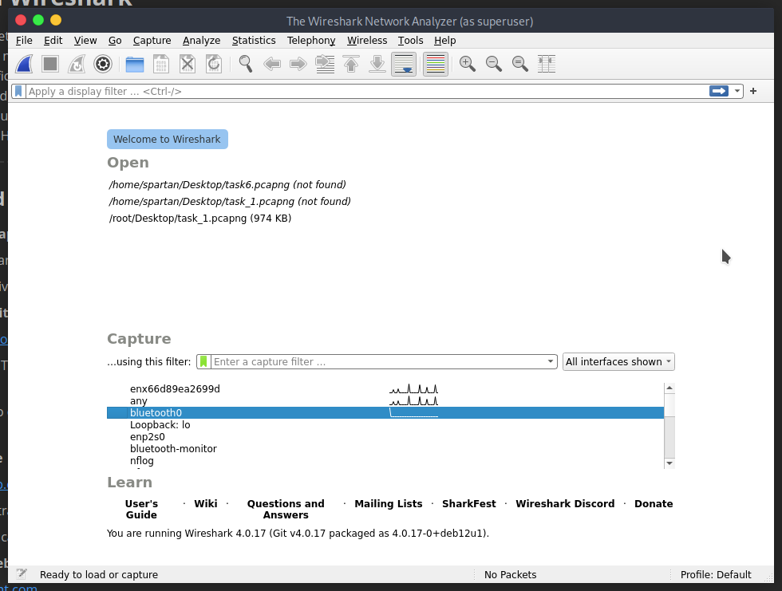
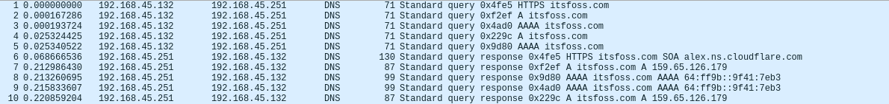
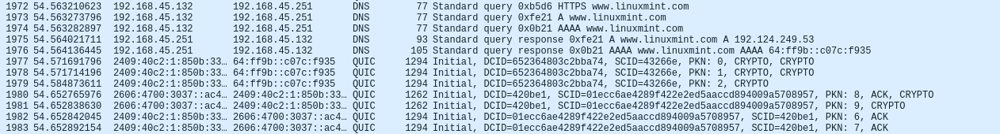
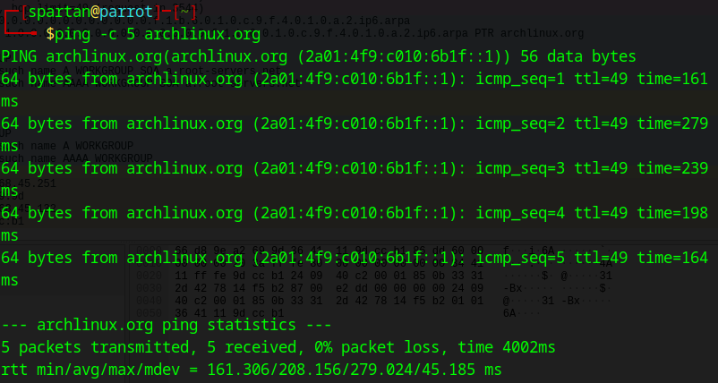
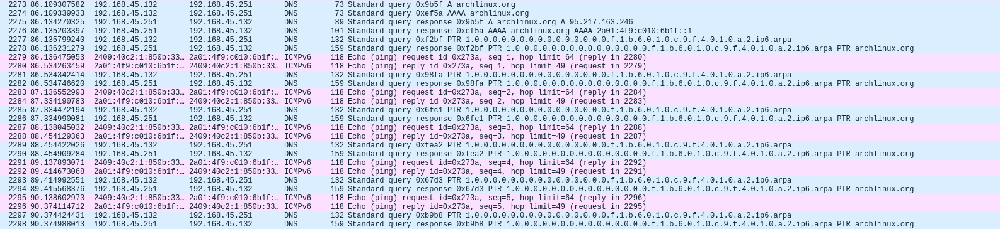

# Internship – Day 5 : Network Traffic Capture with Wireshark

Wireshark is a powerful network protocol analyzer used to capture and inspect data packets traveling across a network. It allows administrators, analysts, and security professionals to view traffic in real time, identify potential issues, troubleshoot connectivity problems, and analyze network behavior. By applying filters and examining packet details, users can understand how devices communicate over various protocols such as HTTP, ICMP, DNS, and more.

---

## Steps Performed

1. **Started Wireshark Capture**
   
   - Launched Wireshark and selected the active network interface for monitoring.
   
   - Began capturing live network packets.
     
     

2. **Visited *ItsFOSS* website**
   
   - Accessed [itsfoss.com](https://itsfoss.com/) from the browser.
     
     
   
   - Observed HTTP/HTTPS request and response packets in Wireshark related to ItsFOSS.
     
     

3. **Visited *GIMP* website**
   
   - Navigated to [gimp.org](https://www.gimp.org/).
     
     
   
   - Observed HTTPS traffic packets with corresponding server responses.
     
     

4. **Visited *Linux Mint* website**
   
   - Accessed [linuxmint.com](https://www.linuxmint.com/).
     
     
   
   - Monitored network activity and confirmed the encrypted communication.
     
     

5. **Performed ICMP Ping Test to Arch Linux**
   
   - Executed the following command in terminal:
     
     ```bash
     ping -c 5 archlinux.org
     ```
     
     
   
   - Captured ICMP request and reply packets in Wireshark.
   
   - Verified packet sequence and round-trip times.
     
     

6. **Stopped Wireshark Capture**
   
   - Stopped the capture session after completing all tests.
   
   - Saved the capture file for documentation and future analysis.

---

In the packet capture, at least three distinct protocols can be observed. **HTTP** is present, used for web communication between clients and servers, typically over port 80. **DNS** appears as well, responsible for translating human-readable domain names into IP addresses. Additionally, **TCP** is seen as the transport protocol providing reliable, ordered delivery of data between endpoints. These protocols work together to enable seamless internet communication.

---

## Summary

In today’s task, we used Wireshark to capture and analyze network traffic generated by visiting various websites and performing an ICMP ping test. We captured traffic for ItsFOSS, GIMP, and Linux Mint websites, identifying protocol activity and verifying secure communication. Additionally, we conducted a ping test to `archlinux.org` and observed ICMP request/reply sequences in the packet view. This exercise provided hands-on experience in monitoring, filtering, and interpreting live network traffic, reinforcing the practical use of Wireshark in network troubleshooting and analysis.
